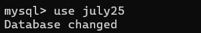
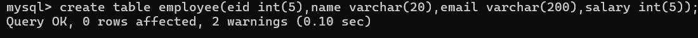
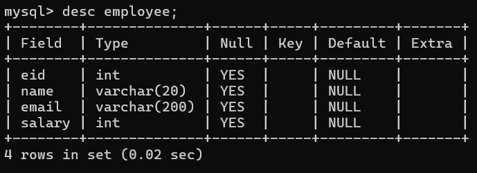
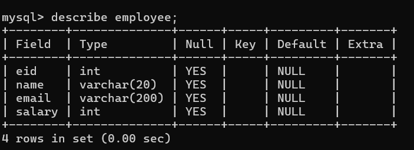

**Database**
Database if a technique where we can organize or store data permanently for manage easily as well as access easily to user.

---

**Types of Database**
a.Relational database.
b.Hierarchical database.
c.Object oriented database.
d.Cloud database.
e.Distributed database.

---

**DBMS**
Database Management System
provide relationship between data internally.

---

**SQL**
Structure Query Language and it is basically programming which works with RDBMS

---

**Steps to work with RDBMS**

1. Download & Install the tool for work with RDBMS
   if we want tot work with RDBMS we have multiple tools and multiple vendors
   **E.g MYSQL, Oracle, DB2, PostgresSQL**
   Now we want to use MYSQL

   **MYSQL**
   MYSQL is a database tool which provide an enviroment fo us to work with RDBMS.

   **Difference between MYSQL, SQL and database**
   MYSQL- is tool responsible for provide enviroment to work with relational database
   SQL - it is programming language work with database management concept
   Database - database is concept or it is technique where we can organize or store data.

   https://dev.mysql.com/downloads/workbench/
   Visit above link for download the MYSQL software

2. Use inbuilt database provided by tool
   When we install MYSQL software or tools we get one inbuild database provided by MYSQL name as mysql.

**RDMS**
Relational Database Management System. it is Collection of tables. 3. create user database : developer can create own database in mysql for his own project and for theat we have command

**Syntax:** create database databasename

**Syntax:** use databasename

Oncce we create database we can work with database and for that we have following types of command.

4. Work with a use database
   **a. DDL**: DDL stands for **data defination language** basically it is used table,procedure,trigger,function,view,database,index as well as drop,alter database,table,procedure,trigger etc.
   **DDL command workds with tables structure**
  
    **1.create:** it is used for create table,creat database,create procedure etc.

    **Example:** we want to create employee table with field or column id,name,email,salary
    

    **2.Desc command:** this command is used for describe the table structure like as column name in table,column data type,column size etc.
    **Syntax:** desc tablename;
    
    OR
    

